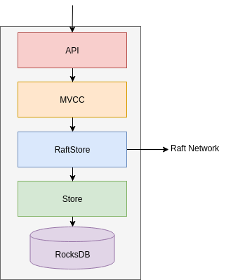
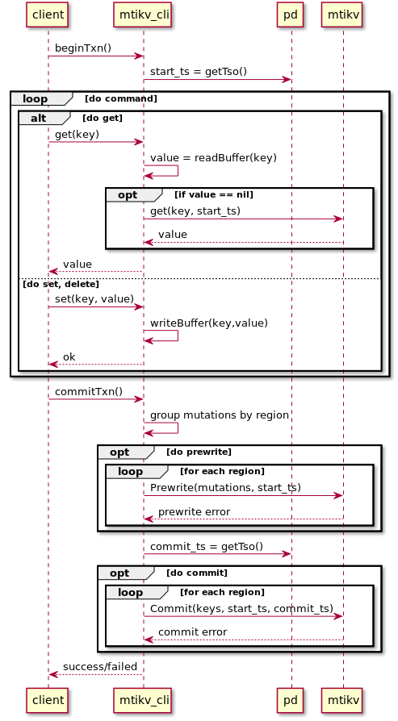
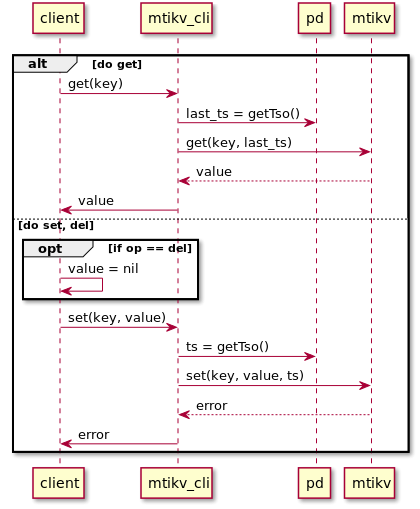

# MTiKV

Mini [TiKV](https://github.com/tikv/tikv): A Distributed transactional key-value database

## Architecture

### Overall

<div align="center"></div>


### Mtikv instance

<div align="center">

</div>


### Raft Group

<div align="center"></div>


## Flow

### TxnKV

<div align="center"></div>


### RawKV

<div align="center"></div>

## Getting Started

### Prerequisites

* **Go**: https://golang.org/doc/install

* **RocksDB:**
    1. Clone repo `Rocksdb`:

    ```sh
    $ cd /home/$USER/Downloads
    $ git clone https://github.com/facebook/rocksdb.git
    ```

    2. Follow [THIS GUIDE](https://github.com/facebook/rocksdb/blob/master/INSTALL.md) to install rocksdb

* **Gorocksdb:**

    1. Set CGO variable

    ```sh
    export CGO_CFLAGS="-I/home/$USER/Downloads/rocksdb/include"
    export CGO_LDFLAGS="-L/home/$USER/Downloads/rocksdb  -lrocksdb -lstdc++ -lm -lz -lbz2 -lsnappy -llz4 -lzstd"
    ```
    2. Get library
    ```sh
    
    $ go get github.com/tecbot/gorocksdb
    ```

### Installing

* **Clone mtikv into workspace:**
    ```sh
    $ cd ~/go/src/github.com && mkdir thoainguyen && cd thoainguyen
    $ git clone https://github.com/thoainguyen/mtikv
    $ cd mtikv
    ```

## Deployment


### 1. Run PD:

```sh
$ cd cmd/pd
$ go run server.go
```

### 2. Run Mtikv_cli:

```sh
$ cd cmd/mtikv_cli
$ go run server.go
```

### 3. Run Mtikv (4 instance):

#### 3.1 Option 1: Run each instance

```sh
$ cd cmd/mtikv
$ go run server.go --node 1
$ go run server.go --node 2 // in another shell
$ go run server.go --node 3 // in another shell
$ go run server.go --node 4 // in another shell
```

#### 3.2 Option 2: Run via goreman

First install [goreman](https://github.com/mattn/goreman), which manages Procfile-based applications.

The [Procfile](./cmd/mtikv/Procfile) script will set up a local mtikv cluster. Start it with:

```sh
$ goreman start
```

### 4. Run Client (CLI)

```sh
$ cd cmd/client
$ go run client.go
```

## Usage:

```sh
$ go run client.go
$ set <key> <value>
$ get <key>
$ del <key>
$ begin    // new transaction
$ commit   // commit transaction
$ rollback // rollback transaction
Ctr+C to exit
```


## Authors

* **Nguyen Huynh Thoai** - *Maintainer* - [thoainguyen](https://github.com/thoainguyen)

## License
## Acknowledgments

* Mentor @thuyenpt
