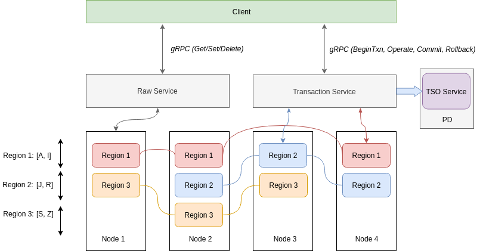
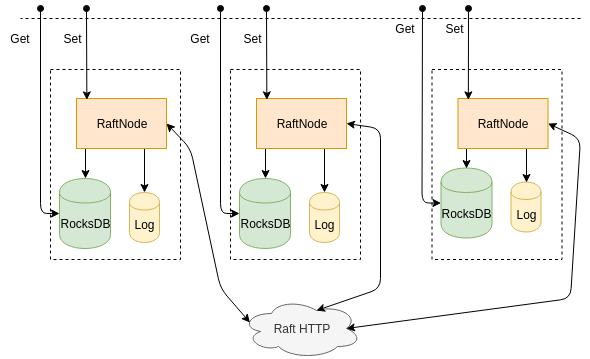
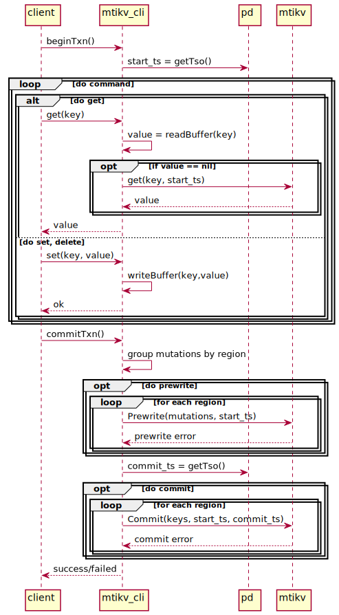
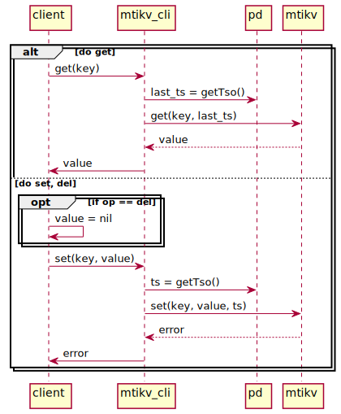

# MTiKV

Mini [TiKV](https://github.com/tikv/tikv): A Distributed transactional key-value database

## Architecture

### Overview

### Raft group

## Flow

### TxnKV

### RawKv

## Getting Started

### Prerequisites

### Installing

## Running the tests

### Break down into end to end tests

### And coding style tests

## Deployment

## Built With

## Contributing

## Versioning

## Authors

* **Nguyen Huynh Thoai** - *Maintainer* - [thoainguyen](https://github.com/thoainguyen)

## License

## Acknowledgments