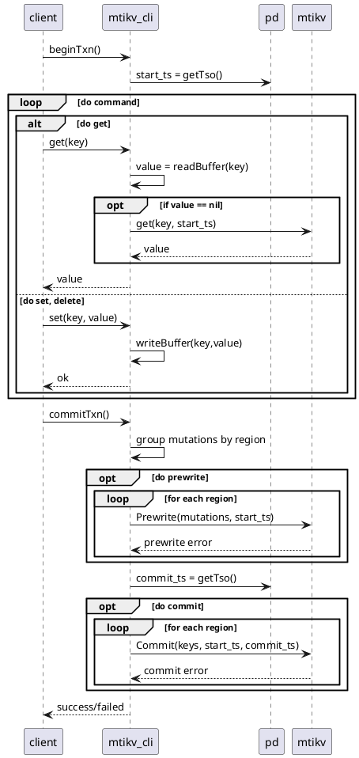

```plantuml
@startuml
client -> mtikv_cli : beginTxn()
mtikv_cli -> pd : start_ts = getTso()
loop do command
    alt do get
        client -> mtikv_cli: get(key)
        mtikv_cli -> mtikv_cli: value = readBuffer(key)
        opt if value == nil
            mtikv_cli -> mtikv: get(key, start_ts)
            mtikv --> mtikv_cli:  value
        end
        mtikv_cli --> client: value
    else do set, delete
        client->mtikv_cli: set(key, value)
        mtikv_cli -> mtikv_cli: writeBuffer(key,value)
        mtikv_cli --> client: ok
    end
end
client -> mtikv_cli: commitTxn()
mtikv_cli -> mtikv_cli: group mutations by region
opt do prewrite
    loop for each region
        mtikv_cli -> mtikv: Prewrite(mutations, start_ts)
        mtikv --> mtikv_cli: prewrite error
    end
end
mtikv_cli -> pd: commit_ts = getTso()
opt do commit
    loop for each region
        mtikv_cli -> mtikv: Commit(keys, start_ts, commit_ts)
        mtikv --> mtikv_cli: commit error
    end
end

mtikv_cli --> client:  success/failed
@enduml
```